## Table of Contents

- Data mining for Soft Eng
    + What is Soft Eng/Project Management
    + Software Analytics
    + Information Sources
    + Software Engineering Repositories
- Tools
- An vice versa? (Soft Eng for Data Scientists)
- Conferences and journals

# Data Mining and Optimisation for Software Engineering


## What is Software Engineering? {.build}

- IEEE Standard Glossary of Software Engineering Terminology Std 610.12-1990, 1991
    1. SE is the application of a systematic, disciplined, quantifiable approach to the development, operation, and maintenance of software; that is, the application of engineering to software. 
    2. The study of approaches as in (1)

- Unlike mathematicians, software engineers should ...
    + ... Measure, Test SW, Estimate, Manage projects, i.e., effort estimation, planning

> In God we trust, all others must bring data (W. Edwards Deming)

> You can’t control, what you can’t measure (Tom DeMarco)

## Software Analytics

`Software analytics` is to enable software practitioners to perform data exploration and analysis in order to obtain insightful and actionable information for data driven tasks around software and services
(Zhang et al, Malets’11)

<div class="centered">

</div>

(Source: MS Research)

## Sources of Information

- `Version Control Systems` or Soft Conf Mang, e.g., Git, SVN
    - Artifacts: Source code, Models, Tests, Requirements, Documentation,...
    - Meta-information about the artifacts: What, Who, Where, When, Why 
    - Main public repositories: GitHUB, Bitbucket
- `Issue/Bug tracking systems`: Bugzilla, Jira, SourceForge
- `Mailing lists` (even question & answer websites)
- `Google Play` and `AppStore` e.g., reviews, starts, updates ...
- `Simulation` can also generate tons of data! e.g. System Dynamics to deal with `What if?` questions
    
    
****
    
<div class="centered">
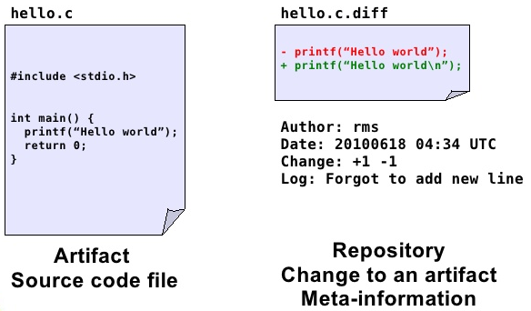
</div>

(Source: I. Herraiz)


## Sources of Information (Tools)

<div class="centered">
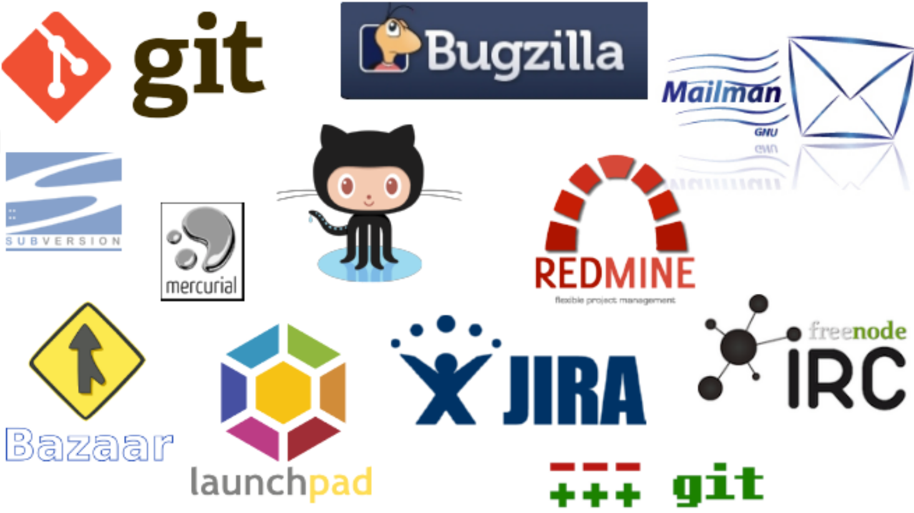
</div>
(Source:Bitergia)


## Software Engieering Life Cycle (SDLC)

<div class="centered">
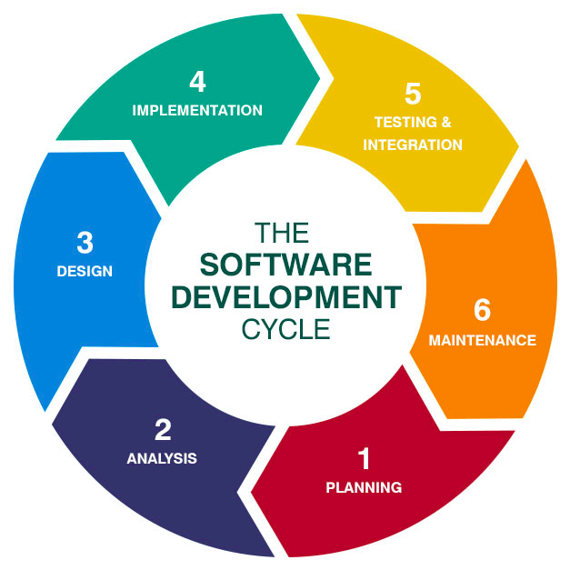
</div>
(Source:Husson Univ)

## SDLC Questions/Optimisations 

- `Requirements`: What requirements will provide most user satisfaction while maximising profit, usability, etc?

- `Analysis and design`: Can we re-organise code/modules/packages so is better distributed for performance/division of labour/allocation of resources, maintenance, etc.
    - Coupling and cohesion of modules

- `Coding`: All types of metrics can be collected from code to predict defects, allocate testing, code clone detection, etc.
    - `Genetic Improvement` or how to plug modules or third party components automatically (e.g., video codecs)

***

- `Testing`: Most testing techniques can be seen as an optimisation problem, test cases should cover (measured as LoC, branches, etc) as much as possible with the minimum no. of test cases
    - There is also reliability estimation, when to stop testing  

- `Maintenance`: Regression testing (or how not to break something when we fix another thing)

-  and phase out (time to quit)

## Project Management

- What is Project Management? Decisions, decisions, decisions!
    - Project management is the application of knowledge, skills, tools, and techniques to project activities to meet the project requirements (PMI).
    - Multiple projects/personnel/resources
    - Iron triangle: Time, cost and scope 

<div class="centered">
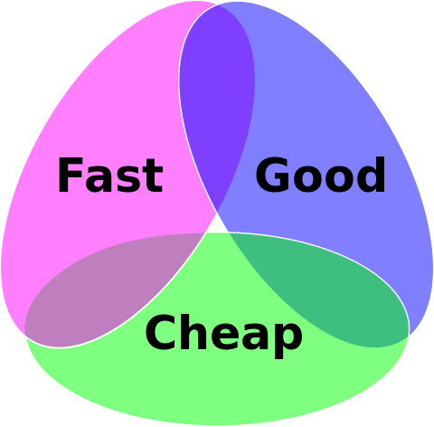
</div>
Pick any two! (Source:Wikipedia) 

****
- Decision making tasks that need to be optimised! 
- And possibly multi-objective!
    - Estimation of Cost/Effort/Schedules
    - Assignment of personnel to tasks
   
- And we can help `project managers` with:
    - Rules, Fuzzy rules, Association Rules
    - Regression
    - Visualisation, early warning of problems, etc.


## From the DM point of view
------------------ ----------------------------
Classification        Defect prediction

Regression            Effort and cost estimation

Recommender Systems   How to use an API, function calls that tend to be together

Time series           Evolution of Projects (Clustering/classification of time series)

Text/Web mining       Reviews, bugs reports, requirements from textual descriptions, code comments, documentation, Function and variable names

------------------ ----------------------------

## From the DM point of view (cont.)
------------------ ----------------------------
Social Net Analysis   Mailing lists, GitHub

Process Mining        Logs collected automatically in Web servers, processes followed correctly

Sequence patterns     Run-time traces

Graph Mining          Dynamic call graphs
----------------- ----------------------------


## SE Repositories

Free/Libre Open Source (FLOSS) has provided tons of data to be analysed. Nowdays, the most popular (`Big Data`!)

<div class="centered">

</div>

For project management, there is the ISBSG  (International SW Benchmarking Standards Group) database but it is not open: http://isbsg.org/

  - `Small data`! R2016 - approx 7,000projects and 60 atts
<div class="centered">

</div>


## Other popular repositories: PROMISE

PROMISE Repository: http://openscience.us/

<div class="centered">
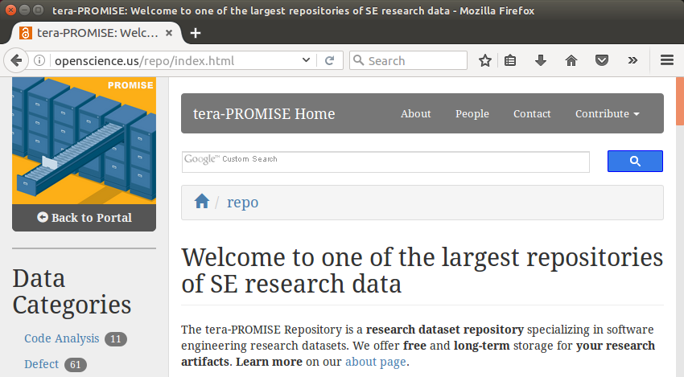
</div>

## Other popular repositories: UDD

Ultimate Debian Database: https://udd.debian.org/

<div class="centered">
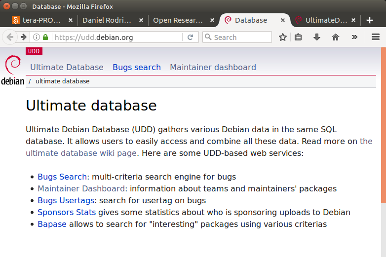
</div>


## SonarQube

<div class="centered">
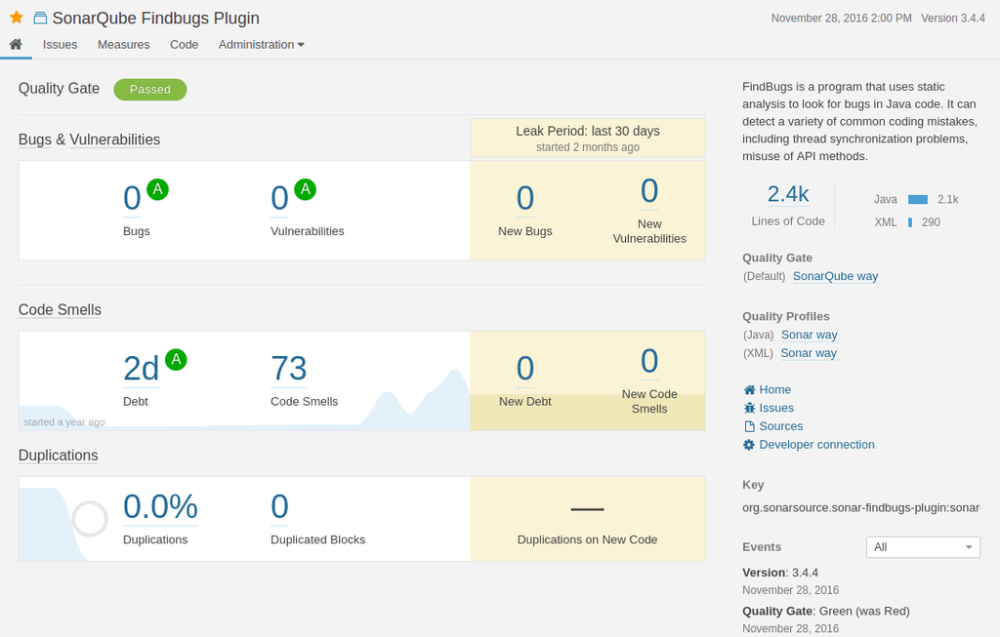
</div>


## Grimoire

<div class="centered">
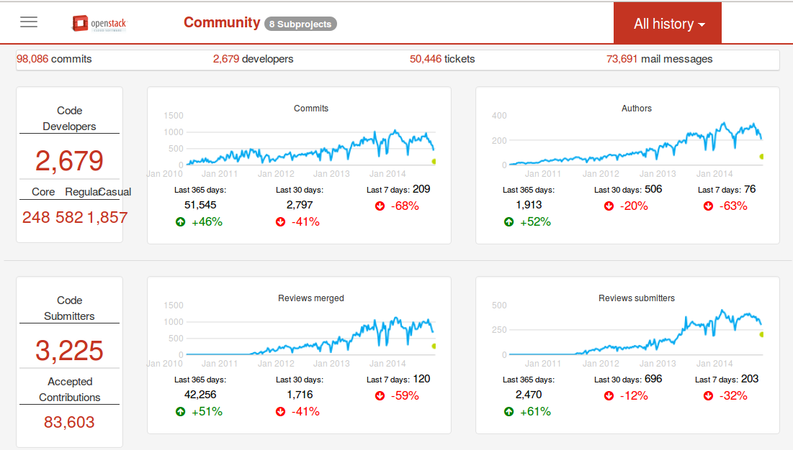
</div>


## Example

<div class="centered">

</div>

(Linus Torvalds, source: http://codequoter.myshopify.com/)

## Metrics Grimore

Create an empty database
```bash
$mysql -u root -p -e 'create database wekaDB;'
```

Run `CVSAnaly2` to populate DB tables
```bash
$cvsanaly2 --db-user=root --db-password=*****  --db- database=wekaDB
Parsing log for /tmp/weka (svn)
Executing extensions
```

## Metrics Grimore (cont.)

Data are ready to be used!

```bash
$ mysql -u root -p -e 'select * from wekaDB.actions limit 5;'
Enter password: 
+----+------+---------+-----------+-----------+
| id | type | file_id | commit_id | branch_id |
+----+------+---------+-----------+-----------+
|  1 | A    |       2 |         1 |         1 |
|  2 | V    |       3 |         2 |         1 |
|  3 | V    |       4 |         3 |         1 |
|  4 | V    |       5 |         4 |         1 |
|  5 | M    |       5 |         5 |         1 |
+----+------+---------+-----------+-----------+
$
```

## Metrics Grimore (cont.)

And visualised
```bash
vg-github.py --user root --passwd ***** 
      --dir /tmp/temp --removedb --ghuser USER --ghpasswd PW 
      --vgdir /home/drg/git/vizGrimoire  --isuser MetricsGrimoire
```
<div class="centered">
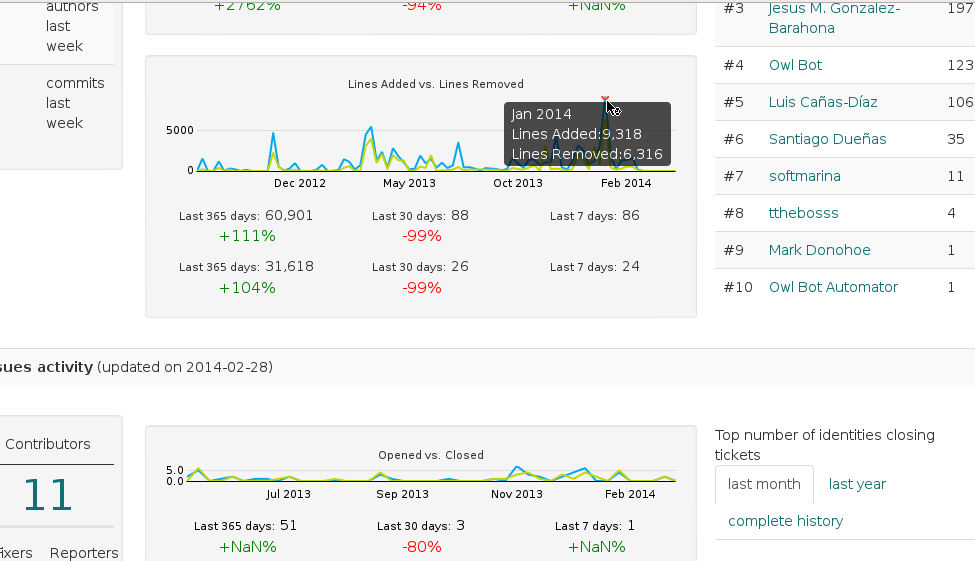
</div>


# And Vice versa?

## Standards and processes for Data Scientist

- CRISP-DM (Cross Industry Standard Process for Data Mining)

<div class="centered">
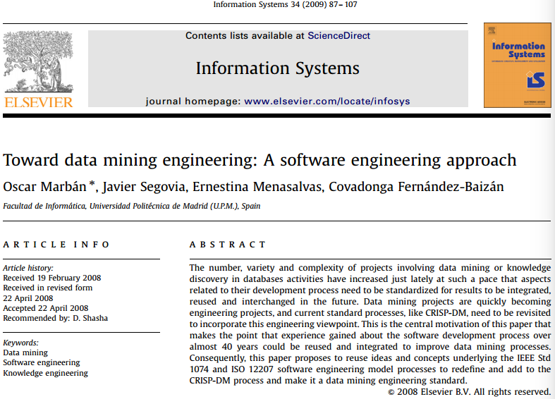
</div>


## Other Standards


- PMML (Predictive Model Markup Language) is a language used to represent predictive analytic models. It allows for predictive solutions to be easily shared between PMML compliant applications (Source: Wikipedia).

- ASUM-DM Analytics Solutions Unified Method for Data Mining/Predictive Analytics is a refined and extended CRISP-DM (Source: IBM)

# What about papers? {.build}

There is a large no. of related conferences:

- Mining Software Repositories (MSR), SCAM, ICSE, ICSM, ESEM, PROMISE ...

- Optimisation related: SSBSE, GECCO (SBSE track)

Including most important journals: Trans on SE, Empirical SE, etc.


## Conclusions

We can wear many hats!

<div class="centered">
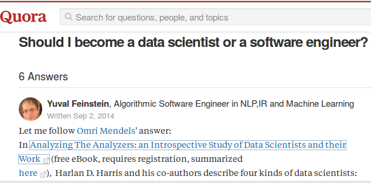
</div>

