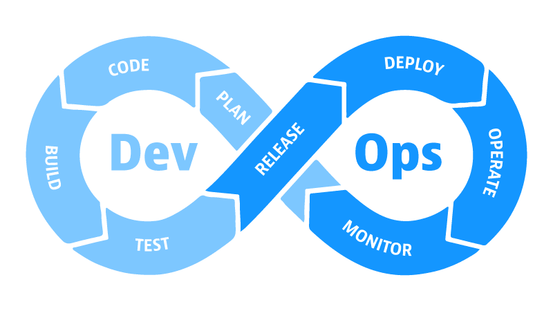
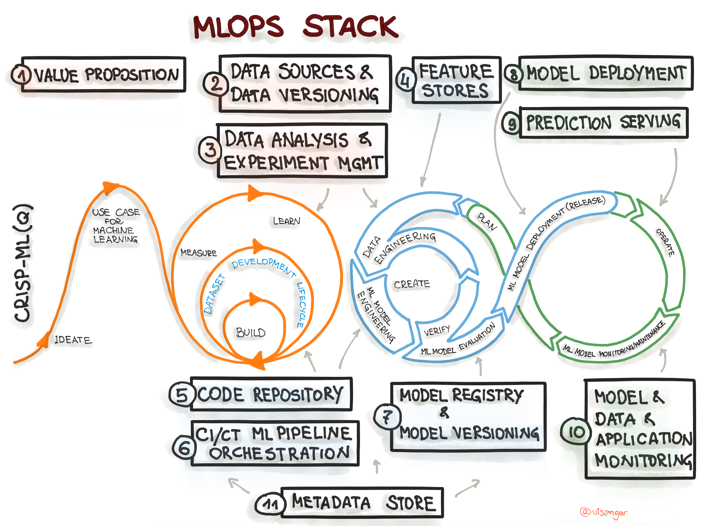

## Table of Contents

- Data mining/ML for Soft Eng
  + Soft Eng/Project Management
  + Software Analytics
  + Information Sources
  + Software Engineering Repositories
  + Tools
- And _vice-versa_? (Soft Eng for DM/ML)
  + DevOps vs MLOps
  + CRISP-DM
- Conferences and journals

# Data Mining and Optimisation for Software Engineering

## Software Engineering? {.build}

- IEEE Standard Glossary of SE Terminology
    1.  SE is the application of a systematic, disciplined, `quantifiable` approach to the development, operation, and maintenance of software; that is, the application of engineering to software.
    2.  The study of approaches as in (1)
- Software engineers measure, test, ...  
- And project management, estimate, Manage projects, i.e., effort estimation, planning

> In God we trust, all others must bring data (W. Edwards Deming)

> You can't control, what you can't measure (Lord Kelvin)

## Software Analytics

`Software analytics` is to enable software practitioners to perform data exploration and analysis in order to obtain insightful and actionable information for data driven tasks around software and services (Zhang et al, Malets'11)

::: centered

:::

(Source: MS Research)


## Software Analytics

As with `KDD` (Knowledge Discovery in Databases) the idea is also to find useful information that was previously unknown! 

::: centered

:::


## Sources of Information

-   `Version Control Systems` or Soft Conf Mang, e.g., Git, SVN
    -   Artifacts: Source code, Models, Tests, Requirements, Documentation,...
    -   Meta-information about the artifacts: What, Who, Where, When, Why
    -   Main public repositories: GitHUB, Bitbucket
-   `Issue/Bug tracking systems`: Bugzilla, Jira, SourceForge
-   `IDE`s: Software Testing, AI assisted development
-   `Mailing lists` (even question & answer websites)
-   `Google Play` and `AppStore` e.g., reviews, starts (quality), updates ...
-   `Simulation` can be used to generate data! e.g. System Dynamics -`What if?` questions

------------------------------------------------------------------------

::: centered

:::

(Source: I. Herraiz)

## Sources of Information (Tools)

::: centered

:::

(Source:Bitergia)

## Software Engieering Life Cycle (SDLC)

::: centered

:::

(Source:Husson Univ)

## SDLC and Examples of Possible ML related Questions/Optimisations

- `Requirements`: 
  + What requirements will provide most user satisfaction while maximising profit, usability, etc? 
  + Effort and cost estimation with AI

- `Analysis and design`: 
  + Can we re-organise code/modules/packages so tey are better distributed for performance/division of labour/allocation of resources, maintenance, etc?
  + Coupling and cohesion of modules
  
------------------------------------------------------------------------

- `Coding`: All types of metrics can be collected from code to predict artifact defects, allocate testing effort, code clone detection, etc.
  + `AI Assisted Development` helping with APIs, suggesting code, etc.
  + `Genetic Improvement` how to plug modules or third party components automatically (e.g., video codecs)?

------------------------------------------------------------------------

- `Testing`
  + Most testing techniques can be seen as an optimisation problem, test cases should cover (measured as LoC, branches, etc) as much as possible with the minimum no. of test cases
    -   Testing automation/optimisation: generation and selection of test cases automatically (mutation testing)
    -   There is also reliability estimation, when to stop testing

- `Maintenance`
  + Regression testing (or test we do not to break something when we fixing another)

- `Phase out`: 
  + When is time to stop/quit maintaining a project?


## Project Management

- Also ML can be applied in `Project Management` 
    - Decisions, decisions, decisions!
    - Project management is the application of knowledge, skills, tools, and techniques to project activities to meet the project requirements (PMI).
    - Multiple projects/personnel/resources
    - Iron triangle: Time, cost and scope. Pick any two! 

::: centered

:::

(Source:Wikipedia)

------------------------------------------------------------------------

-   Decision making tasks that need to be optimised!
-   And possibly multi-objective!
    -   Estimation of Cost/Effort/Schedules
    -   Assignment of personnel to tasks consdiring multiple projects run in parallel
-   And we can help `project managers` with:
    -   Rules, Fuzzy rules, Association Rules
    -   Regression techniques
    -   Visualisation of project status, early warning of problems, etc.

## From the ML point of view

|                     |                            |
|:-------------------|:---------------------------:|
| Classification      | Defect prediction      |
| Regression          | Effort and cost estimation   |
| Recommender Systems | How to use an API, function calls that tend to be together   |
| Time series         | Evolution of Projects (Clustering/classification of time series)  |
| Text/Web mining     | Reviews, bugs reports, requirements from textual descriptions, code comments, documentation, Function and variable names |

------------------------------------------------------------------------

|                     |                            |
|--------------------|:---------------------------:|
| Social Net Analysis |   Mailing lists, GitHub    |
| Process Mining      | Logs collected automatically in Web servers, how actual processes are run, are they followed correctly? can processes be optimised? |
| Sequence patterns   |  Run-time traces           |
| Graph Mining        |  Dynamic call graphs       |


## SE Repositories

Open Source provides tons of data to be analysed. The most popular (`Big Data`!) source is `GitHub`

::: centered

:::

`Diomidis Spinellis` has maintains a list of resources for **mining software engineering** research
<https://github.com/dspinellis/awesome-msr>

::: centered

:::


## Data for Project Management

For project management, there is the ISBSG (International SW Benchmarking Standards Group) database but it is not open: <http://isbsg.org/>

- R2021 - approx 11,600 projects and around 60 attributes (`Small data` though)

    ::: centered
    
    :::

## Other popular repositories

OPEN repositories such as ZENODO: <https://zenodo.org/>

 + It provides code and data with a DOI.
 
::: centered

:::


## Other popular repositories: UDD

Ultimate Debian Database: <https://udd.debian.org/>

::: centered

:::

## SonarQube

::: centered

:::

## GrimoireLab

::: centered

:::

## Example

::: centered

:::

(Linus Torvalds, source: <http://codequoter.myshopify.com/>)

## Metrics Grimore

Create an empty database

``` bash
$mysql -u root -p -e 'create database wekaDB;'
```

Run `CVSAnaly2` to populate DB tables

``` bash
$cvsanaly2 --db-user=root --db-password=*****  --db- database=wekaDB
Parsing log for /tmp/weka (svn)
Executing extensions
```

## Metrics Grimore (cont.)

Data are ready to be used!

``` bash
$ mysql -u root -p -e 'select * from wekaDB.actions limit 5;'
Enter password: 
+----+------+---------+-----------+-----------+
| id | type | file_id | commit_id | branch_id |
+----+------+---------+-----------+-----------+
|  1 | A    |       2 |         1 |         1 |
|  2 | V    |       3 |         2 |         1 |
|  3 | V    |       4 |         3 |         1 |
|  4 | V    |       5 |         4 |         1 |
|  5 | M    |       5 |         5 |         1 |
+----+------+---------+-----------+-----------+
$
```

## Metrics GrimoreLab (cont.)

And visualised:

``` bash
vg-github.py --user root --passwd ***** 
      --dir /tmp/temp --removedb --ghuser USER --ghpasswd PW 
      --vgdir /home/drg/git/vizGrimoire  --isuser MetricsGrimoire
```

::: centered

:::

# And Vice versa? Software Engineering for Machine Learning?

## From DevOps...

DevOps set of practices that combines SW development (Dev) and IT operations (Ops).

::: centered

:::

... to MLOps

## MLOps - Machine Learning Operations 

- `Machine Learning Operations` (MLOps) defines language-, framework-, platform-, and infrastructure-agnostic practices to design, develop, and maintain machine learning applications.
<https://ml-ops.org/>

- MLOps streamlines the process of taking machine learning models to production, and then maintaining and monitoring them. MLOps is a collaborative function, often comprising data scientists, _devops_ engineers, and IT. (DataBricks)

- Machine Learning is part of many software systems and it needs to be managed


## MLOps Stack - https://ml-ops.org/

::: centered

:::


## MLOps Tools

- `MLflow` is an open source platform to manage the ML lifecycle, including experimentation, reproducibility, deployment, and a central model registry

- [https://mlflow.org/](https://mlflow.org/)

- `MLflow` components:

::: centered

:::


## Standards and processes for DM/ML

- CRISP-DM (Cross Industry Standard Process for Data Mining)

::: centered

:::


## Other Standards

- Predictive Model Markup Language (PMML) is a language used to represent predictive analytic models. It allows for predictive solutions to be easily shared between PMML compliant applications (Source: Wikipedia).

- ASUM-DM Analytics Solutions Unified Method for Data Mining/Predictive Analytics is a refined and extended CRISP-DM (Source: IBM)


# What about papers? And venues? 


## Conferences/Workshops

There is a large number of related conferences (in fact, nowadays  most of them seem ML conferences!:

- ICSE (Intl Conf on Soft Eng)
- ICSM (Intl Conf on Software Maintenance and Evolution)
- MSR (Mining Software Repositories)
- PROMISE (Predictive Models and Data Analytics in Software Engineering)
- Etc.


## Optimisation related venues: 

- SSBSE (Search Based Software Engineering)
- GECCO (SBSE track)
- ...


## Journals

Including most important SE journals: 

- IEEE Trans on Soft Eng
- Springer Empirical Soft Eng
- ACM TOSEM
- Journal of Sys and Soft.
- SQJ, IJSEKE etc.


# Conclusions


## We can wear many hats!

::: centered

:::
